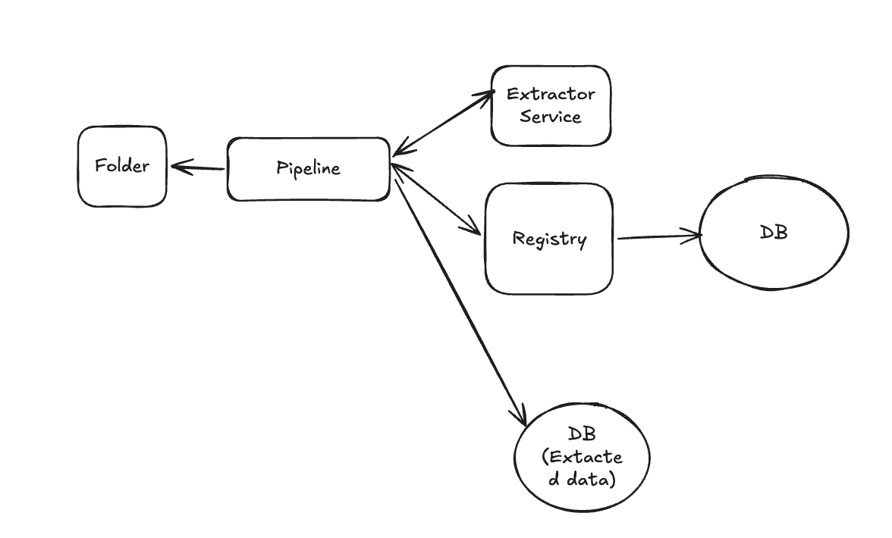

# docflow

A production-style document ingestion pipeline built around a reusable, independent document extraction service, designed for downstream RAG systems.

It focuses on:

- Clean API contracts between services
- Deterministic batch processing
- RAG-ready structured outputs

## Key Requirements

### 1. Functional

- Upload or fetch FDA PDFs
- Structured extraction of PDF documents
- Store processed data
- Detect Document Changes (Versioning)

### 2. Non-Functional

- Scalable (handle many documents)
- Idempotent (don't reprocess same file)
- Reliable (handle failures gracefully)
- Consistent registry and version tracking
- Support retries

## Entities/Tables

1. Document
   - id (PK)
   - sha (unique)
   - filename
   - source
   - created_at

2. Document_versions
   - id
   - doc_id (FK)
   - version_number
   - sha256
   - created_at

3. Extracted
   - id
   - doc_id (FK)
   - version_id (FK)
   - content
   - sections
   - created_at

4. Records_processed
   - id (PK)
   - doc_id (FK)
   - version_id (FK)
   - status (pending / processed / failed)
   - warnings
   - processed_at
   - created_at

## Document Extractor Service (Independent and Reusable)

### Purpose:

A FastAPI-based microservice that:

- Accepts PDF uploads
- Extracts text and structural metadata
- Generates SHA256-based document identity
- Returns a strictly validated response schema

The response includes:

- Document metadata
- Extraction metadata
- Structured content sections

This service is reusable and independent of any specific pipeline.

### API

1. POST /extract
   - accepts a pdf file
   - output: json

### Output structure (json)

- document_metadata
  - filename
  - date
  - mime_type
  - pages
  - version
- extractor_metadata
  - extractor_version
  - service_used
  - service_version
- content
  - full_text
  - sections
    - headings
    - page_no
    - text

## Ingestion Pipeline

A lightweight batch runner that:

- Iterates over local PDF files
- Calls the extraction service
- Stores structured JSON outputs
- Uses SHA-based idempotency to prevent reprocessing

The pipeline is deterministic and safe to rerun.

## Registry

A logical component that manages document state, idempotency, and versioning

- The database is the underlying storage layer.
- The registry encapsulates business logic and interacts with the database, allowing the rest of the system to remain decoupled from storage details.

## High Level Design

